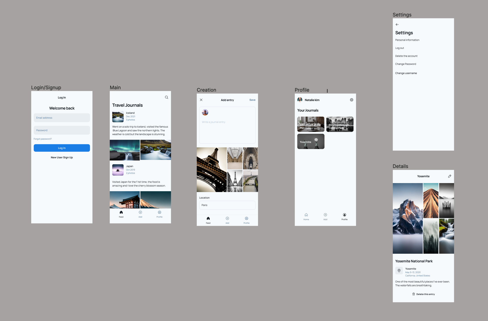

# TRAVEL SNAP

## Table of Contents

1. [Overview](#Overview)
2. [Product Spec](#Product-Spec)
3. [Wireframes](#Wireframes)
4. [Schema](#Schema)

## Overview

### Description

TravelSnap is a mobile application designed to serve as a digital travel journal for users to document and share their travel experiences. It allows users to create rich multimedia entries, including photos, videos, text descriptions, and location tags, to capture the highlights of their journeys.

### App Evaluation

- **Category:** Travel & Lifestyle
- **Mobile:** It's a mobile-first application but could have a web counterpart in the future.
- **Story:** The app tells the story of travelers' adventures and experiences through their personalized travel journals. It captures the essence of memories, exploration, discovery, and connection with new places and cultures.
- **Market:** Travelers of all ages and backgrounds who enjoy documenting their journeys.
- **Habit:** TravelSnap is an occasional use app, typically used during or after a trip to document and share experiences. Users may use it frequently during their travels to capture moments but may not use it daily.
- **Scope:** TravelSnap offers a broad range of features to facilitate comprehensive travel journaling. It includes multimedia entry creation (photos, possibly videos, text descriptions), location tagging, map visualization, and later down the line, social sharing integration and personalized travel recommendations. 

## Product Spec

### 1. User Stories (Required and Optional)

**Required Must-have Stories**

* [X] Register a account (login screen)
* [X] Create Post (new post screen)
* [X] Users can see their post (profile screen)

**Optional Nice-to-have Stories**
* [X] Users can see post history (history/feed screen)
* [X] Users can see posts from other users (social feed)
* [X] Users can see settings to log out, for example (settings screen)
* [ ] User can integrate their journals to other social platforms
* [ ] Users can track weather information base on location and time
* [ ] Users can track their travel budgets daily

### 2. Screen Archetypes
* [X] **Welcome Screen**
* [X] **Authentication Screen**
* [X] User can log in.
* [X] User ca sign up.
* [X] **Feed Screen**
* [X] User can see feed of posts from other users.
* [X] **New Post Screen**
* [X] User can upload photos.
* [X] User can pin travel location on the map.
* [X] User can write descriptions about the travel.
* [X] **Profile Screen**
* [X] User can see all their post and tap on them to go to the detail post screen
* [X] There is a button to go to the settings
* [ ] Users can see their profile picture
* [X] **Settings Screen**
* [X] Users can delete account
* [X] Users can logout
* [ ] Users can change username or password
* [X] **Detail Post Screen**
* [X] Users can see all the details of their post

### 3. Navigation

**Tab Navigation** (Tab to Screen)

- [X] Home tab for social Feeds
- [X] Create tab for making new journals/post
- [X] Home tab for all the journals posted
- [X] Profile tab for personal information and settings

**Flow Navigation** (Screen to Screen)

-  **Login/signup Screen**
  * Leads to **Feed Screen**
-  **Profile Screen**
  * Leads to **Detail Post Screen**
  * Leads to **Settings screen**

## Demo day prep video

https://github.com/Travel-Snap/TravelSnap/assets/78409617/1ba75e78-b930-4596-a7dd-e7ab6c4497b5

## Build progress

Sprint 3 build:

Sprint 2 build:

## Wireframes!

### [BONUS] Digital Wireframes & Mockups

### [BONUS] Interactive Prototype

## Schema 

### Models

[User]
| Property | Type   | Description                                  |
|----------|--------|----------------------------------------------|
| email | String |user's email to sign up |
| username | String | unique id for the user post (default field)   |
| password | String | user's password for login authentication      |
| Journals      | Array of Journal    | user's list of all the jounrals they ever posted                          

[Journal]
| Property | Type   | Description                                  |
|----------|--------|----------------------------------------------|
| location | String | unique id for the user post (default field)   |
| image | image | user's password for login authentication      |
| caption      | String    | user's written description                          

### Networking

- [List of network requests by screen]
- [Example: `[GET] /users` - to retrieve user data]
- ...
- [Add list of network requests by screen ]
- [Create basic snippets for each Parse network request]
- [OPTIONAL: List endpoints if using existing API such as Yelp]
